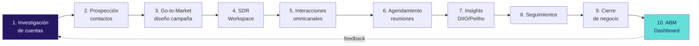
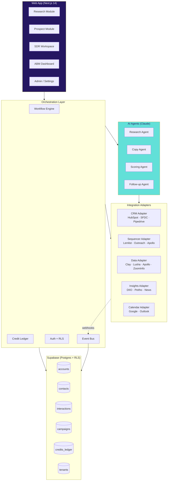
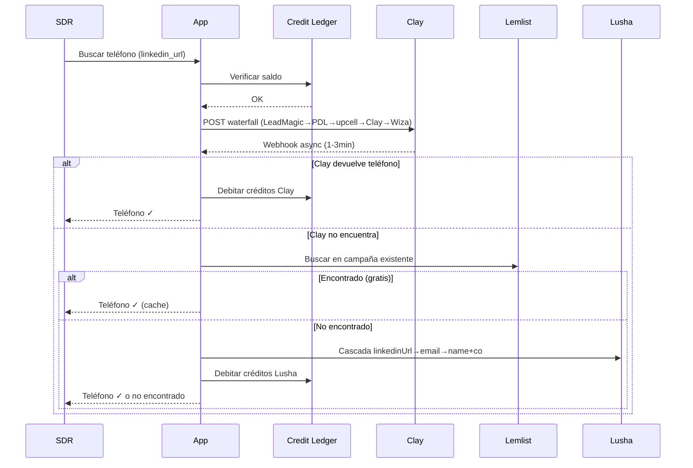
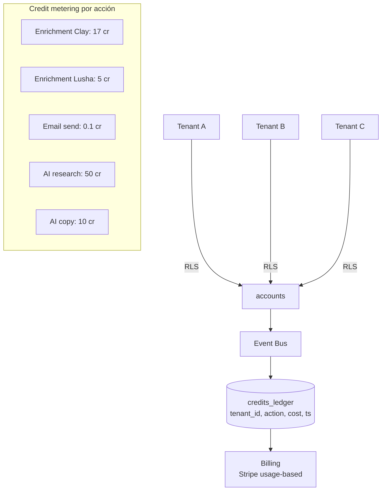

# Diagrama de flujos — ABM SaaS end-to-end

> Renderizan en GitHub, Notion, Obsidian, VS Code (con extensión Mermaid) y en cualquier visor Markdown moderno.

---

## 1. Flujo completo de venta (alto nivel)



---

## 2. Arquitectura técnica detallada



---

## 3. Flujo de enriquecimiento de contacto (waterfall)



---

## 4. Flujo ABM: cuenta → engagement → score

```mermaid
flowchart LR
    subgraph SIGNALS["Señales (Event Bus)"]
        S1[Email opens]
        S2[Link clicks]
        S3[LinkedIn views]
        S4[Replies]
        S5[Meeting booked]
        S6[DIIO: nueva licitación]
        S7[Peitho: cambio ejecutivo]
        S8[News intent]
    end

    SIGNALS --> SC[Scoring Agent<br/>Claude]
    SC --> ACC[(Account<br/>engagement_score)]
    ACC --> DASH[ABM Dashboard<br/>Hot Accounts]
    DASH --> NBA[Next Best Action<br/>Follow-up Agent]
    NBA --> SDR[SDR Workspace<br/>cola priorizada]
```



---

## 5. Multi-tenant + credit ledger



---

## 6. SDR Workspace — diagrama de pantalla (ASCII mock)

```
┌─────────────────────────────────────────────────────────────────┐
│ ABM SaaS · SDR Workspace                    [Saldo: 12,430 cr] │
├──────────────┬──────────────────────────────────────────────────┤
│ Cola del día │  María González · CFO @ Acme Corp                │
│ (priorizada) │  Score: 87 🔥  ·  Última int: hace 3d            │
│              │  ┌────────────────────────────────────────────┐  │
│ 🔥 María G   │  │ Timeline (omni)                            │  │
│ 🔥 Pedro R   │  │  ✉  Open email "Q4 prop"  hace 3d          │  │
│ ⭐ Ana T     │  │  💼 Vio perfil LinkedIn   hace 2d          │  │
│ ⭐ Luis V    │  │  📰 DIIO: nueva licitación pública         │  │
│ · Carla M    │  └────────────────────────────────────────────┘  │
│ · ...        │                                                  │
│              │  Próxima mejor acción (IA):                      │
│              │  → Llamar mencionando licitación DIIO            │
│              │  [Llamar] [Email] [LinkedIn DM] [Snooze]         │
└──────────────┴──────────────────────────────────────────────────┘
```
